# 小水手绘注解

**上传一张图，自动识别场景，添一点自然的手绘感。**

照片加轮廓与小符号，产品页面圈重点，数据复盘标结论。画面丰富就少加，画面简单可以稍丰富，保留原有设计。

作者：[Sherry小水](https://github.com/XshuiAi) · [下载 Skill](https://github.com/XshuiAi/shui-handdraw-annotation/archive/refs/heads/main.zip) · [MIT](LICENSE)

安装后，上传图片并说：

> 调用小水手绘注解 Skill，自动识别这张图的场景并生成手绘注解，保留原有设计。

## 吃饭与生活记录

实拍照片搭配白色轮廓、手写字和小符号。先看一张聚餐大图，再看近景。

<table>
<tr><td width="50%"></td><td width="50%"><a href="examples/reference-matcha.png">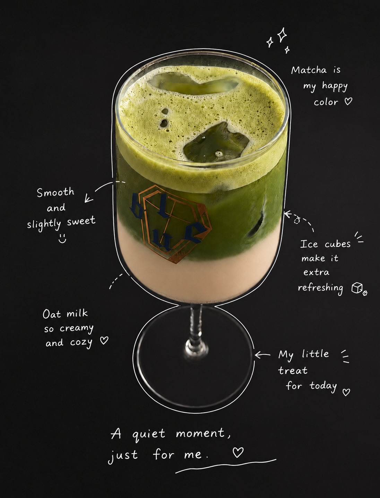</a></td></tr>
<tr><td>餐盘近景 · 小水早期成品</td><td>抹茶描边 · 第三方风格参考</td></tr>
</table>

聚餐与餐盘为此前的成品，未配原图；抹茶为外部参考的生成式整理图，来源小红书号 **914648542**，不是本 Skill 的生成案例。

## 产品讲解 · 选选

记录清单、新建记录、对比分析，三张页面并排看。后两张为早期产品讲解成品；当前版本默认减少配字，不新增底部总结条。

<table>
<tr><td width="33%"></td><td width="33%"><a href="examples/ui-new-record-legacy.png">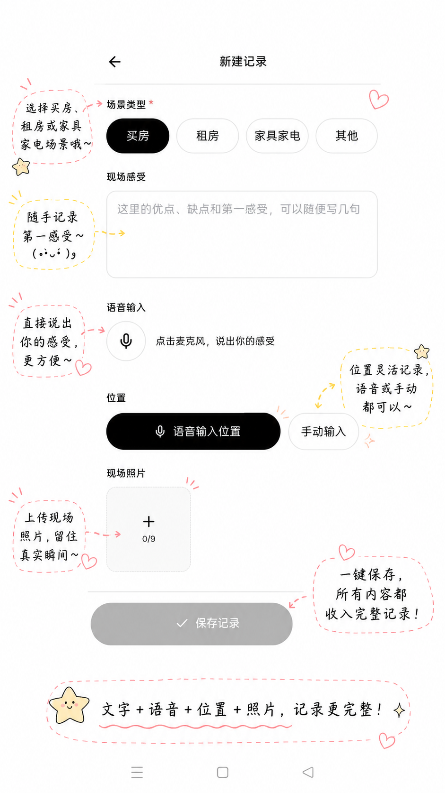</a></td><td width="33%"><a href="examples/ui-comparison-legacy.png">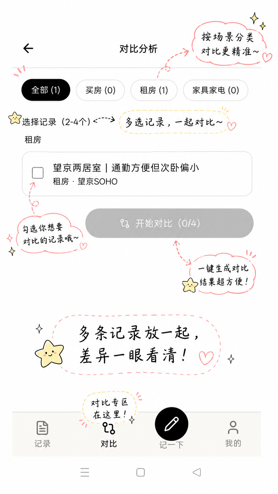</a></td></tr>
<tr><td>记录清单</td><td>记一下 · 早期成品</td><td>对比分析 · 早期成品</td></tr>
</table>

记录页前后对比：圈出主要区域，保留页面信息。

| 原图 | 手绘注解 |
|---|---|
|  |  |

## 苹果、咖啡与音乐

简单苹果图可以多一点线稿呼应；已有书页文字或复杂纹理的照片，只加短标签与少量符号。

<table>
<tr><td width="33%"><a href="examples/apple-after.png">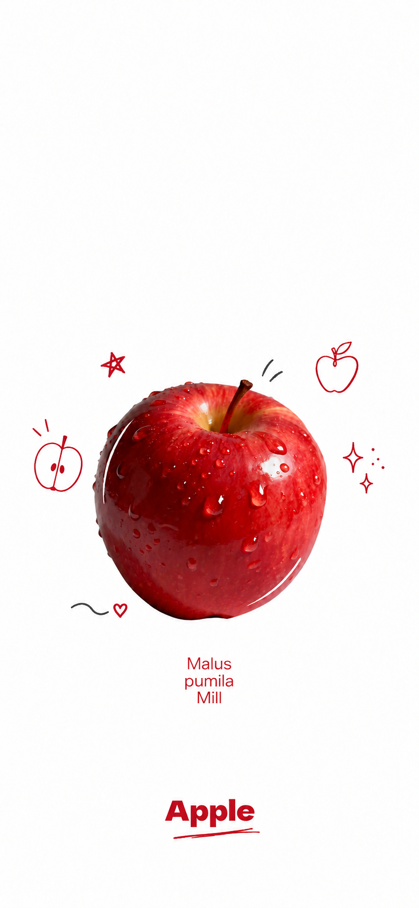</a></td><td width="33%"><a href="examples/coffee-after.png">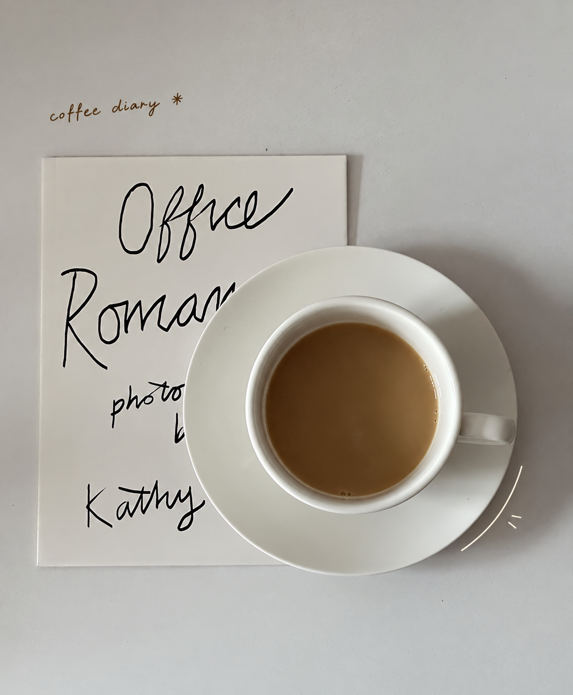</a></td><td width="33%"></td></tr>
<tr><td>Apple · 线稿与小符号</td><td>coffee diary · 局部轮廓</td><td>vlog · 音乐符号</td></tr>
</table>

以上为小水在外部底图上的手绘试作。苹果原图署名 **WEIBO @G195**；咖啡、耳机原图来源 **Loveove_12e**。底图权利不属于本项目 MIT 授权。

## 数据复盘

突出“教程占52.4%”和“第4周较上周+25%”，不加食物式描边、花朵或表情。

| 原图 | 手绘注解 |
|---|---|
|  |  |

此处为演示数据；原图已有的刻度偏差未修正。生成式编辑可能改变细节，正式使用 UI 或数据图前需逐项核对。

## 更多描边参考

以下为用户提供的**第三方风格参考，经生成式裁切整理**，不是本 Skill 的生成成果，也不是原作的无损裁切。学习轮廓、笔触与留白的搭配；参考图里的长文案不会成为默认配字。

<table>
<tr><td width="33%"><a href="examples/reference-bagel.png">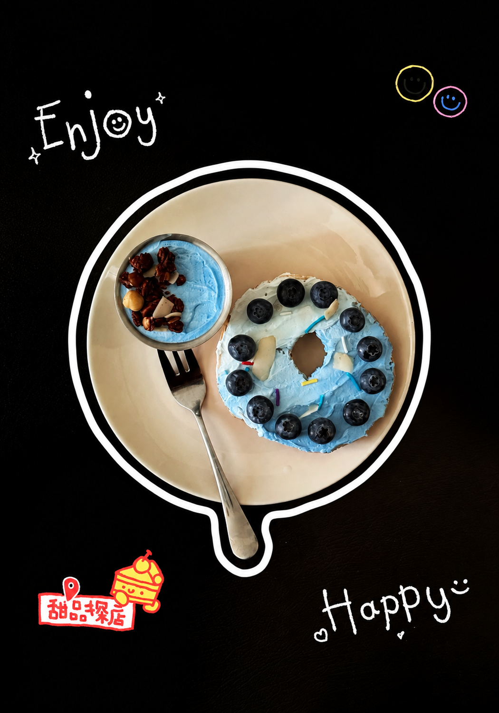</a></td><td width="33%"><a href="examples/reference-toast-light.png">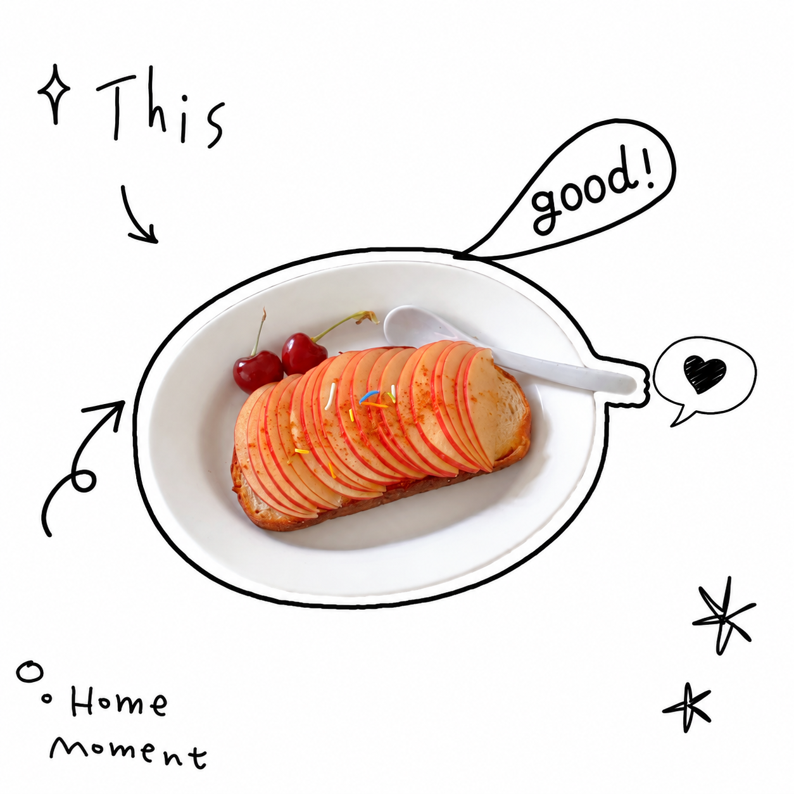</a></td><td width="33%"><a href="examples/reference-toast-dark.png">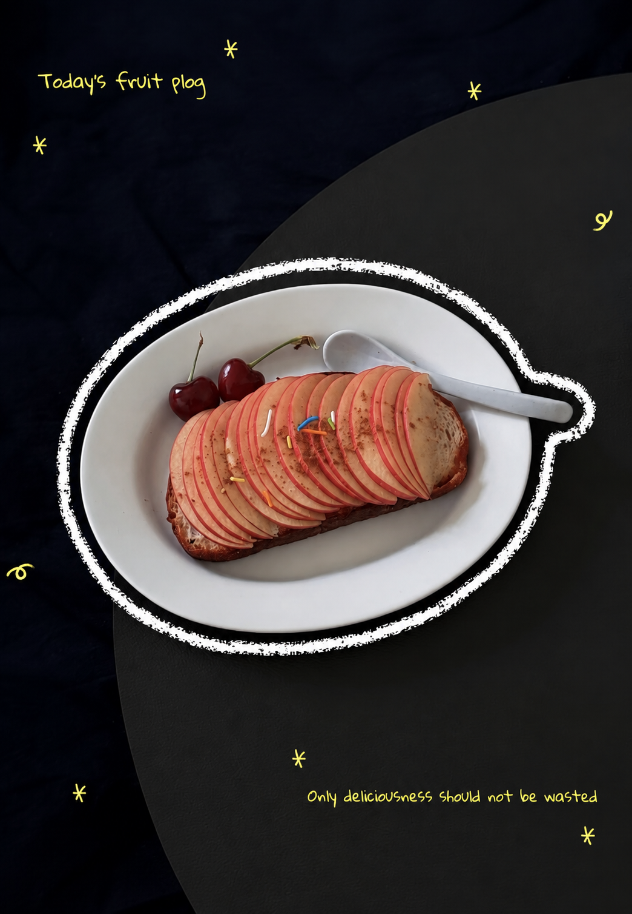</a></td></tr>
<tr><td>白色轮廓</td><td>黑色轮廓与对话框</td><td>粉笔笔触</td></tr>
</table>

来源：小红书「**K的修图日记**」。

<table>
<tr><td width="33%"><a href="examples/reference-avocado.png">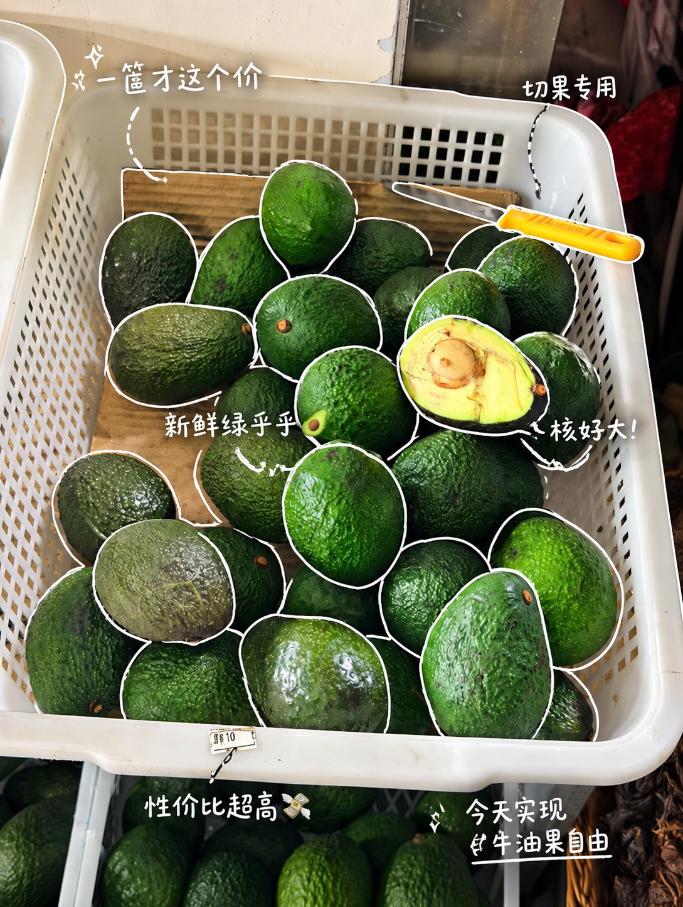</a></td><td width="33%"><a href="examples/reference-coffee-phone.png">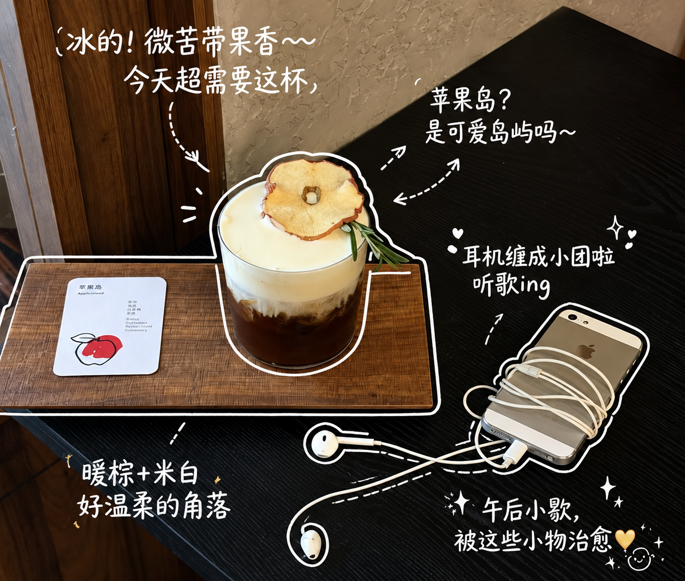</a></td><td width="33%"><a href="examples/reference-outdoor.png">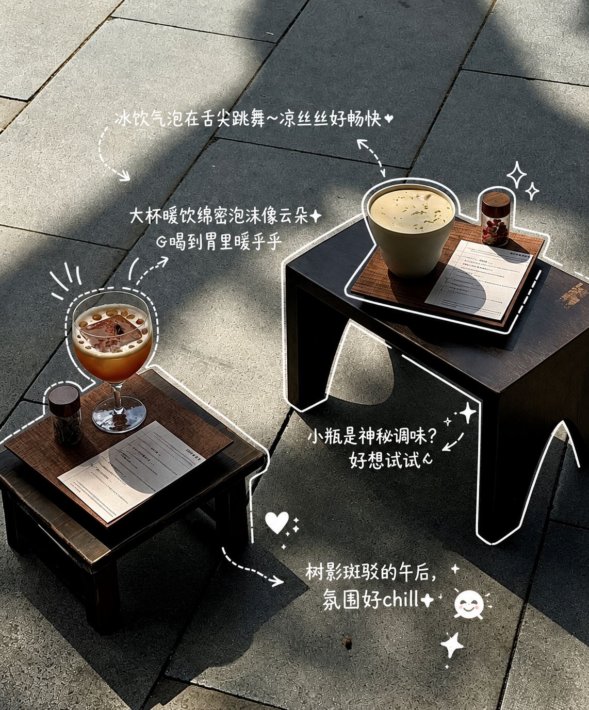</a></td></tr>
<tr><td>牛油果 · 原作者待核实</td><td>咖啡与手机 · Lisa</td><td>户外咖啡 · Lisa</td></tr>
</table>

参考图保留原作者归属，具体来源见 [案例说明](examples/README.md)。

## 自动适配

| 图片类型 | 默认处理 |
|---|---|
| 食物、日常、旅行、实拍物件 | 适量局部描边、简短英文标签、相关小符号 |
| 实拍产品宣传 | 保留品牌气质，点出可见细节，不编卖点 |
| App、网页、操作截图 | 圈重点、短说明，不加物件描边 |
| 数据看板、轻量复盘 | 标可核验的数值与关系，不加无关装饰 |

复杂图少加，简单图稍丰富。默认不抠图换背景、不重排页面、不修改原有文字与数字。

## 安装与调用

需要支持 Skill 导入和图片编辑的 AI 工具。本仓库提供技能指令，不自带生图模型或付费额度。

1. [下载](https://github.com/XshuiAi/shui-handdraw-annotation/archive/refs/heads/main.zip)并解压，把含 `SKILL.md` 的文件夹导入工具的技能目录。Codex 用户级位置为 `~/.codex/skills/shui-handdraw-annotation/`，已有同名技能先备份。
2. 上传图片，使用页面开头的一句话。Codex 也可直接说：`使用 $shui-handdraw-annotation 处理这张图。`

豆包或其他工作环境需先完成技能导入并具备图片编辑能力；未安装时，仅输入技能名字不会自动加载本仓库。不用填写长提示词，也不用先指定场景、笔色和装饰数量。

## 作者与许可

作者：[Sherry小水](https://github.com/XshuiAi)。技能指令和项目文档采用 [MIT](LICENSE)；二次开发、复制或再分发须保留 `Copyright (c) 2026 Sherry小水` 和完整许可声明。生成图片不强制加作者水印。

案例图片与第三方素材不在 MIT 授权范围内，原作者、品牌与包装图案的权利保留。不得把风格参考冒称为本项目原创或技能实测成果。

公开版可直接调用。作者未公开的创作笔记、完整测试提示词和内部调试资料不随包提供。
