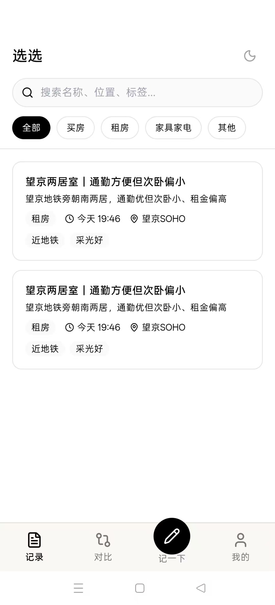
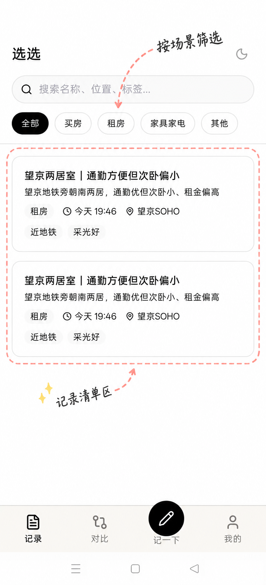
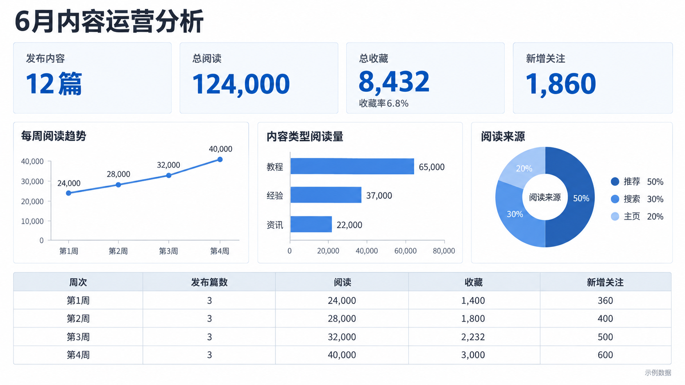
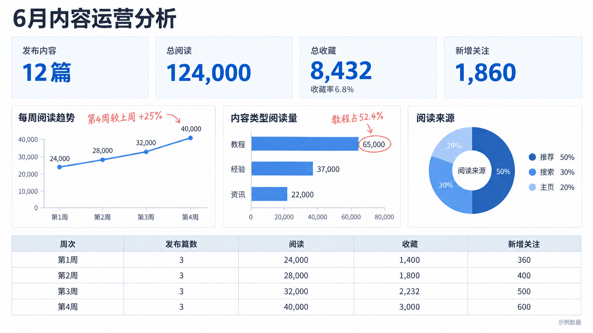
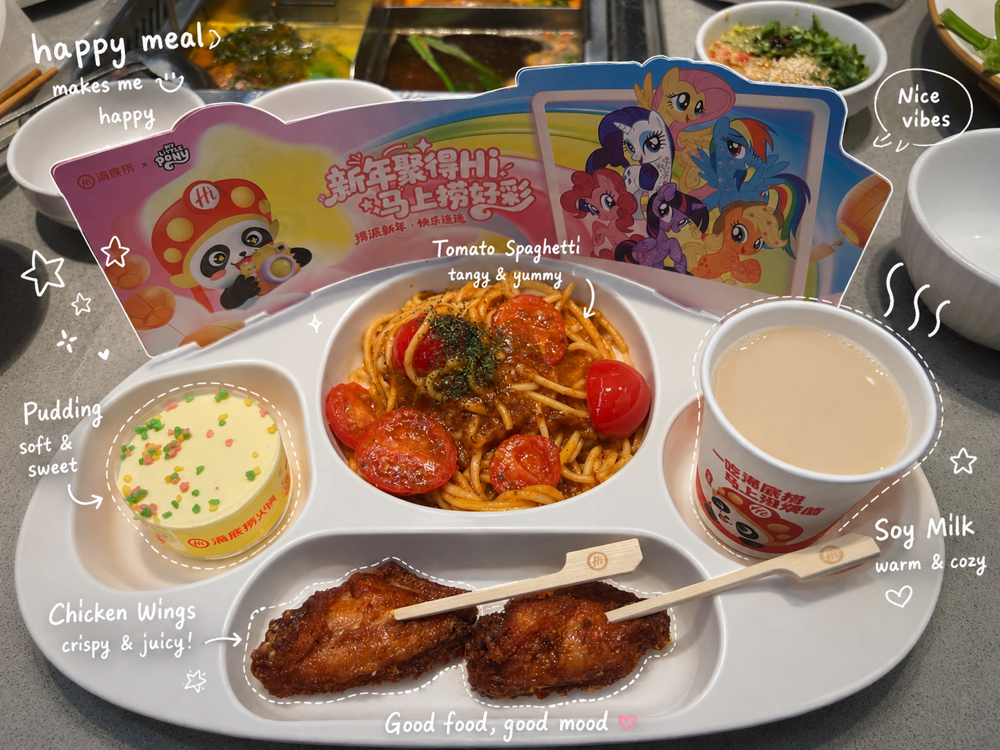
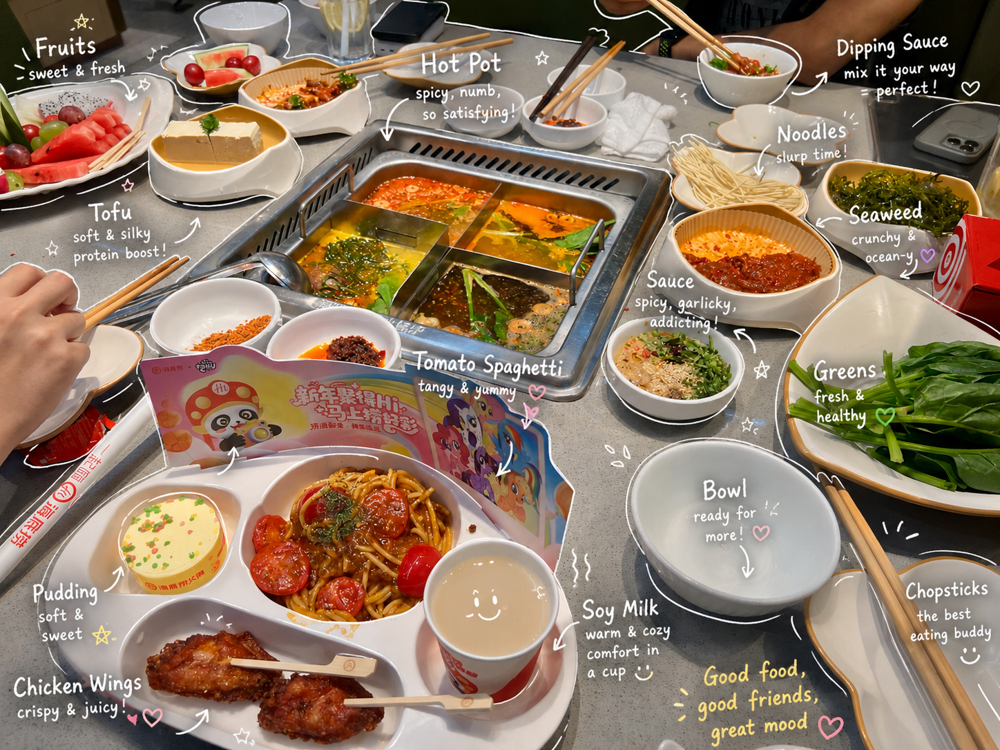

# 小水手绘注解

**上传一张图，让它多一点手绘感。**

为生活照片、产品图、App 截图和轻量汇报添加手写短标签、细线与情境小元素。原图复杂就少加，简单图可以稍丰富，让装饰与原有设计相处得自然。

作者：[Sherry小水](https://github.com/XshuiAi) · [MIT](LICENSE)

## 能做什么

| 你的图片 | 可以做成 |
|---|---|
| 吃饭、咖啡、旅行照片 | 带英文短标签、局部轮廓和小符号的生活记录 |
| 水果、实拍产品、宣传图 | 主体保持真实、细节点缀更鲜明的产品图 |
| App、网页截图 | 圈出主要区域、少量短说明的功能介绍 |
| 数据看板、轻量复盘 | 标出关键数字与趋势的讲解图 |

不需要自己编一大段提示词。上传图片，说明用途即可。

## 前后对比

### 产品讲解 · 选选记录页

只圈出记录清单，提示分类筛选，不把每个按钮都解释一遍。

| 原图 | 手绘注解 |
|---|---|
|  |  |

### 数据复盘 · 内容运营分析

突出“教程占52.4%”和“第4周较上周+25%”。数据是演示数据，原图已有的刻度偏差不在此次注解中修正。

| 原图 | 手绘注解 |
|---|---|
|  |  |

### 生活记录 · 吃饭

早期对话中的食物成品案例，用于展示白色手绘线条与实拍照片的搭配。对应原图暂缺，因此只展示成品；不是当前版本的前后保真测试。

查看另一张聚餐成品

生成式图像编辑可能改变细节；涉及 UI 或精确数字时应逐项核对。输出效果也会受宿主模型、图片清晰度和画面密度影响。

## 怎么用

需要支持 Skill 和图片编辑的 AI 工具。这个仓库提供技能指令，不自带生图模型或付费额度。

1. 下载本仓库，把含有 `SKILL.md` 的文件夹作为技能安装到工具支持的技能目录。
2. 在 Codex 中，用户级入口通常为 `~/.codex/skills/shui-handdraw-annotation/SKILL.md`；已有同名技能时先备份或选择其他名称，勿直接覆盖。
3. 上传原图并说：

> 使用 $shui-handdraw-annotation，把这张图做成自然的手绘注解，保留原有设计。

也可以补充一句：

- “这是我的日常照片，用英文短标签，元素稍丰富。”
- “这是产品页面，圈重点，中文说明少一点。”
- “这是工作复盘，只强调两处数据。”
- “给我原图和成品的前后对比。”

其他支持技能导入的工具请按其安装方式操作；只支持普通聊天的工具不能仅靠仓库链接自动获得图片编辑能力。

## 署名与许可

技能指令和项目文档采用 MIT。二次开发、复制或再分发时，须保留 `Copyright (c) 2026 Sherry小水` 和完整 MIT 许可声明。MIT 不要求每张生成图自动加水印。

案例图片的来源与适用范围见 [案例说明](examples/README.md)。图片中的品牌、第三方包装图案及相关权利不因本项目 MIT 许可而转移。

本仓库提供可直接使用的公开版本。作者的内部调试记录、创作笔记和完整测试资料不在发行包内。

